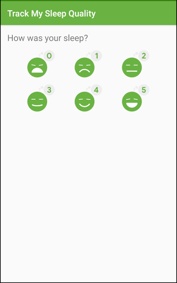
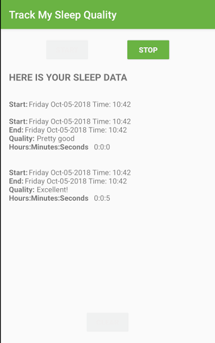

# SleepTracker App

The SleepTracker app is an Android app that helps you collect information about your sleep. 

This app relies on Room Database and DAO to store and access sleep data.
It displays the information using RecyclerView in a grid layout with click listeners.
It implements coroutines for the database operations and also uses ViewModels, Data binding, LiveData, Adapters, ViewHolders etc.

## Screenshots

 
  
  
 

